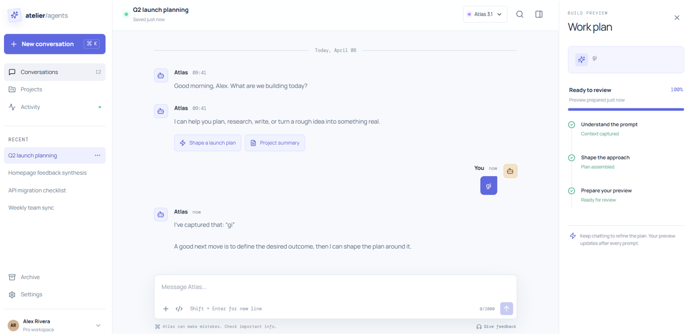
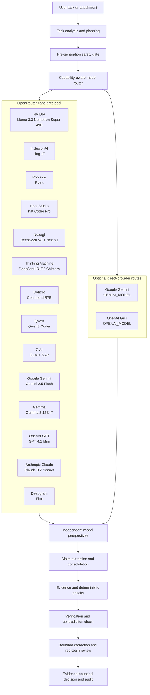

# HackFusion — Multi-Talented Agent

> An evidence-first, multi-model analysis workspace. HackFusion treats every model response as a perspective to investigate—not proof—and returns a visible decision, evidence trail, limitations, and model-level audit record.



## Contents

- [What it does](#what-it-does)
- [How a run is verified](#how-a-run-is-verified)
- [Architecture](#architecture)
- [Features](#features)
- [Included model catalog](#included-model-catalog)
- [Quick start](#quick-start)
- [Provider configuration](#provider-configuration)
- [Using the app](#using-the-app)
- [API](#api)
- [Project structure](#project-structure)
- [Testing](#testing)
- [Security and privacy](#security-and-privacy)
- [Deployment](#deployment)
- [Known limits](#known-limits)

## What it does

HackFusion is a Node.js single-page application for asking questions, analyzing files, comparing model perspectives, and checking the claims in the result. It supports general questions, research, mathematics, code, documents, and images.

Rather than selecting an answer through model popularity, a run plans the task, selects capable available models, generates independent responses, consolidates claims, retrieves available evidence, performs checks, finds contradictions, applies bounded corrections when possible, and records a final decision.

With real provider credentials, HackFusion calls live providers. With no configured provider key, it enters an explicitly labelled deterministic demo mode; demonstration responses are never represented as live model output.

## How a run is verified

```text
Task analysis → Planning → Model routing → Independent generation
      ↓
Claim extraction → Evidence retrieval → Verification → Contradiction check
      ↓
Correction (when deterministic) → Red-team review → Final decision
```

Every completed run has a specialist-agent ledger covering planning, routing, reasoning, evidence retrieval, verification, tools, safety, criticism, correction, and finalization.

### Decision policy

Model agreement is a signal, not proof. A result is only marked **Verified** when the configured evidence, independent checks, contradiction, safety, and coverage gates pass. Otherwise HackFusion returns a limited, rejected, partial, or failed result and explains why.

Confidence is shown as an approximate, green band and is capped below certainty. The underlying audit retains the original calculated score.

## Architecture



The router calls only models that are enabled and currently available. In Smart mode it can make bounded recovery or disagreement-driven additions; in Selected models mode, it never crosses the user’s fixed provider boundary.

## Features

### Multi-model routing

- Supports OpenRouter, direct Google Gemini, and direct OpenAI adapters when configured.
- Offers Smart routing, all available models, and a fixed custom model selection.
- Smart routing can add bounded backup models after provider failures and independent perspectives when successful models materially disagree.
- A fixed custom selection is respected: no unselected backup model is silently added.
- Code mode prioritizes NVIDIA in Smart routing while retaining a bounded verification pool.
- Successful model perspectives are individually viewable from the Available models panel.

## Included model catalog

The default OpenRouter pool contains the following **configured candidates**. A model is selectable only when registry discovery and the provider health check mark it available. Free-model status, paid access, quotas, and provider capacity can change; the live registry is the source of truth at run time.

| Provider | Configured model ID | Primary capabilities |
| --- | --- | --- |
| NVIDIA | `nvidia/llama-3.3-nemotron-super-49b-v1:free` | Reasoning, math, coding |
| InclusionAI | `inclusionai/ling-1t:free` | Reasoning, research |
| Poolside | `poolside/point:free` | Coding, reasoning |
| Dots Studio | `dots-studio/kat-coder-pro:free` | Coding, math |
| Nexagi | `nex-agi/deepseek-v3.1-nex-n1:free` | Reasoning, research |
| Thinking Machine | `tngtech/deepseek-r1t2-chimera:free` | Reasoning, math |
| Cohere | `cohere/command-r7b-12-2024:free` | Research, reasoning |
| Qwen | `qwen/qwen3-coder:free` | Coding, math, reasoning |
| Z.AI | `z-ai/glm-4.5-air:free` | Reasoning, coding |
| Google Gemini via OpenRouter | `google/gemini-2.5-flash` | Research, reasoning, coding, math, documents, vision |
| Gemma | `google/gemma-3-12b-it:free` | General, documents |
| OpenAI GPT via OpenRouter | `openai/gpt-4.1-mini` | Reasoning, coding, research, vision |
| Anthropic Claude | `anthropic/claude-3.7-sonnet` | Reasoning, coding, research, vision |
| Deepgram | `deepgram/flux:free` | General, research |

Two optional direct-provider routes are also included in the registry when their keys are configured:

| Direct route | Environment-controlled model | Default | Role |
| --- | --- | --- | --- |
| Google Gemini | `GEMINI_MODEL` | `gemini-3.8-flash` | Complex-task perspective and final evidence-bounded review when available |
| OpenAI GPT | `OPENAI_MODEL` | `gpt-4.1-mini` | Independent direct-provider perspective |

Use `MODEL_POOL_JSON` only when you intentionally want to replace the default OpenRouter candidate pool.

### Evidence and verification

- Normalizes model responses into claim records with per-claim state and provenance.
- Links claims to supplied documents, curated demonstration data, and deterministic results where available.
- Identifies unsupported claims and contradictions.
- Independently checks arithmetic and stores bounded deterministic corrections with re-verification.
- Uses a code-verification gate. Arbitrary code is never accepted as executed unless a hardened isolated executor is enabled.
- Runs a red-team assessment for unsupported assumptions, counterexamples, contradictions, and unsafe overreach.
- Shows a disagreement radar, model contribution map, assumptions, and conditions that could change the answer.

### Files, results, and auditability

- Supports Ask, Research, Code, Document, and Math tasks.
- Accepts TXT, Markdown, JSON, CSV, PDF, DOCX, PNG, JPEG, WebP, and GIF attachments.
- Extracts PDF and DOCX text locally before analysis; sends images only to selected, available vision-capable models.
- Treats attachments as untrusted data and detects prompt-injection-like content.
- Streams execution progress using Server-Sent Events and optional stage sounds.
- Displays final answers separately from their limitations, model responses, claim matrix, evidence, checks, corrections, and agent ledger.
- **Challenge answer** saves a new red-team assessment.
- **Approve**, **Request evidence**, and **Reject** save human-review records without falsely changing the automated verification decision.
- **Replay analysis** starts a new run using the same sanitized task and currently available providers.
- Exports a Markdown verification report. The JSON audit endpoint remains available to API consumers.

### Interface and evaluation

- Three-pane conversational home workspace.
- Analysis dashboard with session outcome and model-health metrics.
- Provider availability indicators, responsive layouts, accessible focus styles, and a Back to home control on every non-home screen.
- Nine reproducible evaluation scenarios for demonstrations and regression coverage.

## Quick start

### Prerequisites

- Node.js 20 or newer (Node 22 is used in the current test environment)
- npm

### Run locally

```powershell
Copy-Item .env.example .env
npm install
npm run lint
npm test
npm start
```

Open [http://localhost:3000](http://localhost:3000).

For auto-restart during development:

```powershell
npm run dev
```

On macOS or Linux, use `cp .env.example .env` instead of `Copy-Item`.

## Provider configuration

Copy `.env.example` to `.env` and place credentials only in that local file or your hosting platform’s secret store. Never commit `.env`.

| Variable | Purpose |
| --- | --- |
| `OPENROUTER_API_KEY` | Server-side key for the OpenRouter model gateway. |
| `OPENROUTER_ALLOW_PAID_MODELS` | Allows paid OpenRouter candidates when `true`. |
| `GEMINI_API_KEY`, `GEMINI_MODEL` | Optional direct Google Gemini key and model. |
| `OPENAI_API_KEY`, `OPENAI_MODEL` | Optional direct OpenAI API key and model. A ChatGPT subscription is not an API key. |
| `DEMO_MODE` | Keeps deterministic demo fallback enabled unless set to `false`. |
| `PORT` | HTTP server port; defaults to `3000`. |
| `MODEL_COUNT`, `MAX_MODEL_CALLS`, `MIN_SUCCESSFUL_MODELS` | Smart-pool size, maximum calls, and recovery target. |
| `MAX_CONCURRENT_MODEL_CALLS`, `MAX_RETRIES`, `MODEL_TIMEOUT_MS` | Provider concurrency, retry, and timeout limits. |
| `MODEL_OUTPUT_TOKENS`, `COMPLEX_MODEL_OUTPUT_TOKENS` | Normal and complex response budgets. |
| `MAX_CORRECTION_LOOPS`, `MAX_ROUNDS` | Bounded correction and orchestration limits. |
| `ADAPTIVE_DISAGREEMENT_THRESHOLD` | Smart-routing disagreement trigger. |
| `MAX_INPUT_CHARS`, `MAX_DOCUMENT_CHARS`, `MAX_FILE_BYTES` | Input and attachment limits. |
| `CONFIDENCE_THRESHOLD`, `EVIDENCE_THRESHOLD`, `CONTRADICTION_THRESHOLD` | Decision-gate thresholds. |
| `SANDBOX_ENABLED`, `SANDBOX_IMAGE` | Enables code execution only with a hardened isolated executor. |
| `ADMIN_TOKEN` | Required for the administrative status endpoint. |

`MODEL_POOL_JSON` may also define a custom provider pool. See [.env.example](.env.example) for the complete safe template.

The **Provider settings** page can change provider keys and model names only from the server host, unless an authorized administrative request is used. Public configuration never returns credential values.

## Using the app

1. Open Home and enter a task, or choose a reproducible scenario.
2. Select Smart, All available, or Selected models. Use a fixed selection when strict provider boundaries matter.
3. Attach a file or image when it is relevant to the task.
4. Choose Quick, Balanced, Deep, or Maximum verification depth and start the analysis.
5. Watch model routing, generation, evidence, verification, correction, and finalization progress.
6. Inspect the final answer, limitation notes, model answers, claim matrix, evidence, checks, and specialist-agent ledger.
7. Challenge the answer, save a human review, request evidence, reject it, or replay the task as needed.

For a useful demonstration, run **Conflicting Answers** to show disagreement handling, then **Self-Correction** to show a deterministic correction and re-verification record.

## API

All API responses are JSON except report exports and the event stream. Responses use no-store caching and security headers.

| Method | Endpoint | Purpose |
| --- | --- | --- |
| `GET` | `/api/health` | Safe runtime health and gateway mode. |
| `GET` | `/api/config` | Public configuration without secrets. |
| `GET` | `/api/models?refresh=true` | Current model registry and availability. |
| `GET` | `/api/scenarios` | Reproducible evaluation scenarios. |
| `GET` | `/api/runs` | Run summaries for the current in-memory session. |
| `POST` | `/api/runs` | Starts an analysis and returns a run ID plus event URL. |
| `GET` | `/api/runs/:runId` | Full audit record for a run. |
| `GET` | `/api/runs/:runId/events` | Server-Sent Event progress stream. |
| `POST` | `/api/runs/:runId/attack` | Stores a red-team challenge. |
| `POST` | `/api/runs/:runId/review` | Stores `approve`, `request-evidence`, or `reject` human review. |
| `POST` | `/api/runs/:runId/replay` | Starts a new run from the saved sanitized task. |
| `GET` | `/api/runs/:runId/export?format=markdown` | Downloads a Markdown verification report. |
| `GET` | `/api/runs/:runId/export?format=json` | Retrieves complete audit JSON. |
| `GET` | `/api/analytics` | Session analytics. |
| `GET` | `/api/evaluation` | Evaluation dataset, golden cases, and metrics. |
| `POST` | `/api/feedback` | Stores result feedback. |
| `POST` | `/api/settings/providers` | Updates provider settings from loopback or an authorized request. |
| `GET` | `/api/admin/status` | Authorized administrative status. |

### Start a run

```json
POST /api/runs
{
  "task": "Explain why 25 × 48 equals 1200.",
  "mode": "Math",
  "poolMode": "smart",
  "verificationMode": "balanced",
  "customModels": [],
  "documents": []
}
```

The response is `202 Accepted` with a `runId`, `status: "running"`, and `eventsUrl`.

## Project structure

```text
.
├── public/                   # Single-page UI, styles, and progress indicators
├── src/
│   ├── server.js             # HTTP API, SSE, security headers, static files
│   ├── pipeline.js           # Planning, routing, verification, correction, decisions
│   ├── modelGateway.js       # OpenRouter, Gemini, OpenAI, and demo adapters
│   ├── documentExtraction.js # PDF and DOCX text extraction
│   ├── evaluation.js         # Scenarios, golden cases, analytics
│   ├── report.js             # Markdown, HTML, and compact audit reports
│   ├── config.js             # Validated environment configuration
│   └── store.js              # In-memory runs, events, feedback
├── test/                     # API integration and pipeline tests
├── .env.example              # Safe configuration template
├── AGENTS.md                 # Agent role and data contracts
└── package.json              # Scripts and runtime dependencies
```

## Testing

```powershell
npm run lint
npm test
```

The current suite has **46 passing tests**. It covers secret-safe health output, input validation, classification, attachments, injection detection, routing, provider availability, custom-pool boundaries, claims, evidence, contradictions, confidence, decisions, corrections, safety blocking, streamed runs, exports, challenges, human review, replay, UI action wiring, and every built-in deterministic evaluation scenario.

## Security and privacy

- Provider keys stay server-side and are never returned by health or public configuration routes.
- `.env` is ignored by Git; use a deployment secret store in production.
- Provider-setting changes are limited to loopback requests unless an `ADMIN_TOKEN` is supplied.
- Requests, attachment count, file size, document size, model concurrency, retries, and correction loops are bounded.
- Uploaded-document text is treated as untrusted data, not system instructions.
- Unsafe and high-risk tasks are blocked before model or tool calls.
- Static and API responses set CSP, no-sniff, frame-denial, referrer, and permissions-policy headers.
- Run data is stored in memory for the current server session; this is not a persistent multi-user data store.

## Deployment

HackFusion is a standard Node service:

```bash
npm ci
npm start
```

Configure environment variables in the hosting platform, especially provider keys, `PORT`, paid-model policy, and any production sandbox configuration. Keep `SANDBOX_ENABLED=false` until a hardened isolated executor for arbitrary code has been installed and verified.

Before release, run `npm run lint` and `npm test`, add the public application and repository URLs, and perform a responsive browser pass over the result page and provider settings.

## Known limits

- Provider availability, OpenRouter free-model IDs, quotas, rate limits, and capacity can change between requests.
- A configured provider may still fail at generation time because of capacity, billing, or quota. The audit records that failure, and Smart routing may recover with healthy candidates.
- General live-web research is not fabricated. Evidence is limited to supplied files, curated demonstration data, deterministic checks, and available model output unless a dedicated research connector is added.
- PDF and DOCX extraction supports text extraction; complex scanned documents may require OCR through a vision-capable model.
- Browser-level visual testing requires a connected browser surface.
- Code output remains conditional unless the hardened sandbox is configured and its isolated check passes.

## License and contributors

Add the project license, team members, public repository URL, and deployment URL before external release.
